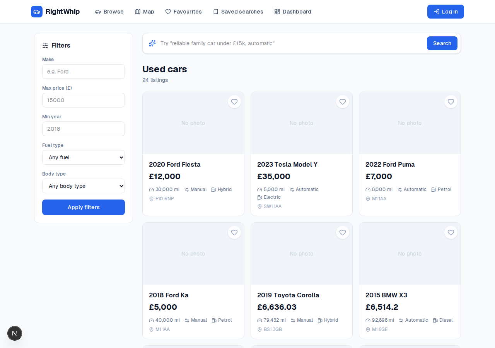
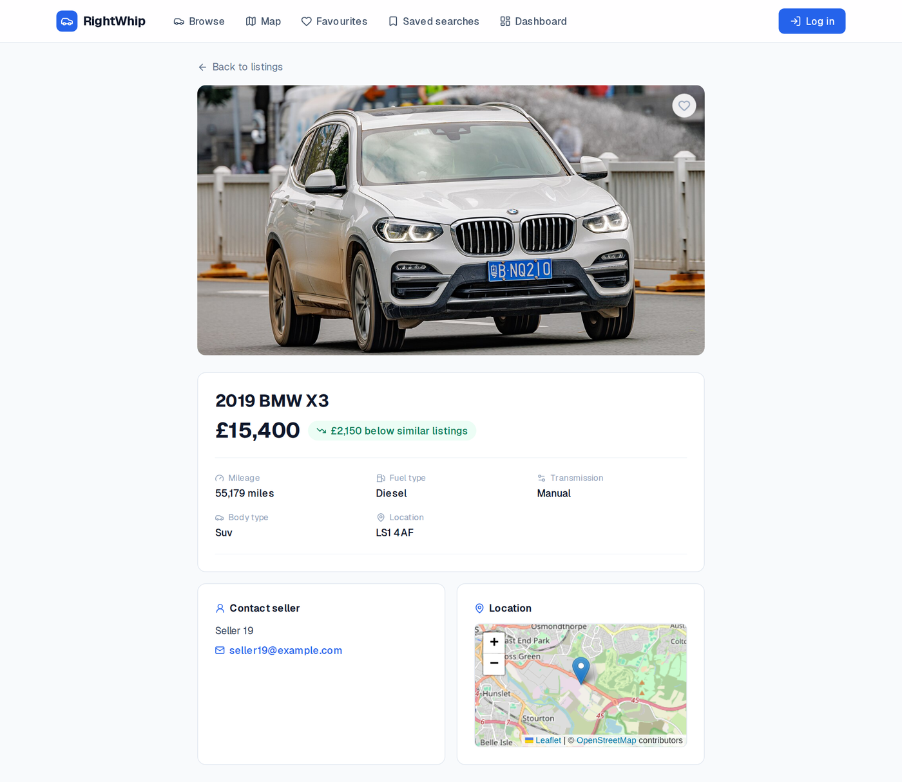
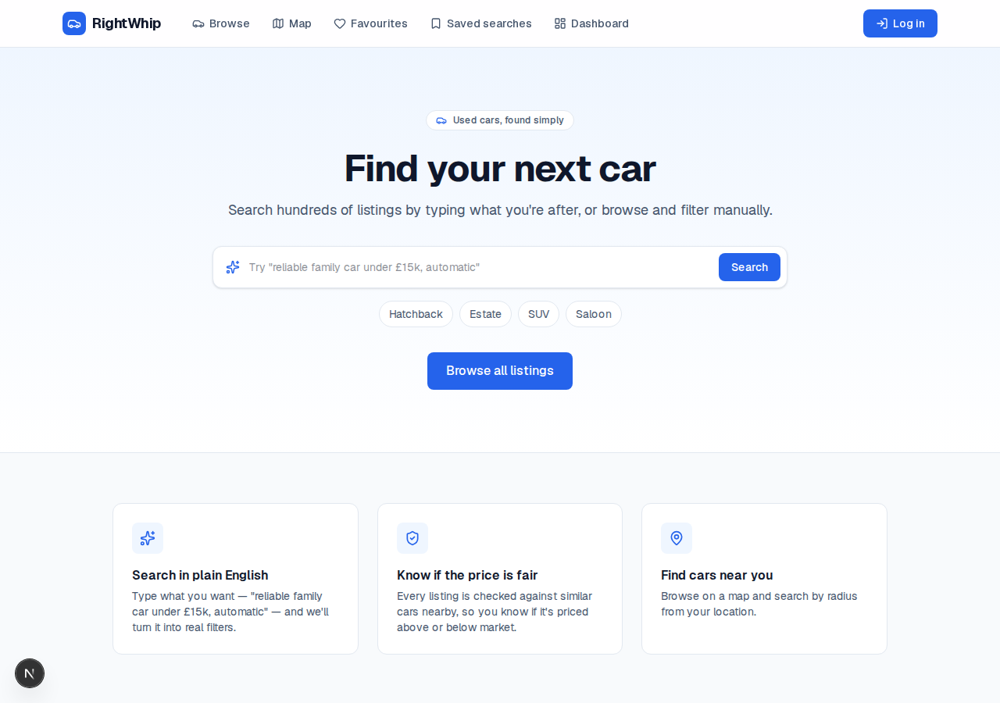
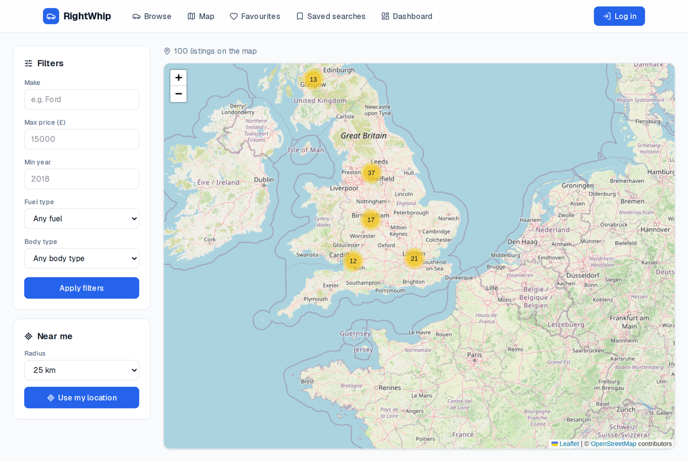
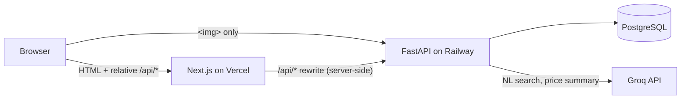

# RightWhip

A used-car marketplace with LLM-powered natural-language search and fair-price
analysis. Browse and filter listings, search in plain English ("cheap diesel
estate near Manchester under £8k"), see how each car is priced against genuinely
comparable ones, save searches, and get notified when new matches appear.

**Live:** [right-whip.vercel.app](https://right-whip.vercel.app)
&nbsp;·&nbsp; **Demo login:** `seller1@example.com` / `demo1234`

---

## Screenshots

<!-- Drop PNGs into docs/screenshots/ with these names and they'll render here. -->

| Browse & filter | Listing detail with price analysis |
|---|---|
|  |  |

| Natural-language search | Map view with radius search |
|---|---|
|  |  |

## Features

| | |
|---|---|
| **Browse & filter** | Make, price, year, mileage, fuel, transmission, body type; sort by price/mileage/recency; paginated. |
| **Natural-language search** | Free-text query → structured filters via Groq (`openai/gpt-oss-120b`) in JSON mode. The model only ever produces filters, which are validated against real database values before use — it never touches SQL. |
| **Fair-price analysis** | Each listing is compared against cars of the same model within ±2 years and ±20% mileage, using Postgres `percentile_cont` for the median and quartiles. A badge shows "£1,200 below similar listings" — suppressed when the sample is too small to be meaningful. |
| **Map view** | Leaflet map with marker clustering and radius search ("within 25km of here"). Listings without a dropped pin are geocoded from their postcode. |
| **Accounts** | Register / log in (argon2 hashing, JWT in an httpOnly cookie), post listings as drafts, upload photos, publish, delete. |
| **Favourites & saved searches** | Heart a listing; save a filter set; a background job flags saved searches with new matches since last checked. |

## Stack

- **Frontend** — Next.js 16 (App Router, TypeScript), Tailwind v4, Leaflet
- **Backend** — FastAPI, SQLAlchemy, Alembic, Pydantic
- **Database** — PostgreSQL
- **AI** — Groq API (OpenAI-compatible, free tier), structured JSON output
- **Infra** — Docker (multi-stage), GitHub Actions CI, Vercel (web) + Railway (API + Postgres)

## Architecture



The browser only ever talks to the Vercel origin. Client-side calls use relative
`/api/*` paths, which Next.js rewrites **server-side** to the FastAPI service — so
the auth cookie stays first-party and there's no CORS in the request path. The
only direct browser→API traffic is `` tags loading listing photos.

This creates a build-time vs. runtime env-var split worth knowing about:
`NEXT_PUBLIC_API_URL` (browser-facing, baked into the bundle at build time) and
`API_URL` (server-to-server, read at runtime) hold the same value in local dev
but differ once the frontend and API are on separate hosts.

## Running locally

### With Docker Compose (everything)

```bash
cp api/.env.example api/.env        # set JWT_SECRET; GROQ_API_KEY optional
docker compose up --build
```

- web → http://localhost:3000
- api → http://localhost:8000 (docs at `/docs`)

Then seed some data:

```bash
docker compose exec api python -m scripts.seed
```

### Without Docker

**API:**
```bash
cd api
python -m venv .venv && source .venv/bin/activate
pip install -r requirements-dev.txt
cp .env.example .env                # edit it
alembic upgrade head
python -m scripts.seed
uvicorn app.main:app --reload
```

**Web:**
```bash
cd web
npm install
cp .env.example .env.local
npm run dev
```

## Tests

```bash
cd api && pytest                    # needs a Postgres at localhost:5432, db "autotrail_test"
cd web && npm run test:e2e          # Playwright, against a running dev server
```

CI (`.github/workflows/ci.yml`) runs the pytest suite against a real Postgres
service container plus lint + production build for the web app, on every push
and PR.

## Known limitations

- **Uploaded photos are stored on the API container's local disk**, which is
  ephemeral on Railway — they don't survive a redeploy. A production build would
  use object storage (S3 / R2).
- The seed's demo sellers all share one password; fine for a public demo, not a
  pattern for real accounts.

## Project layout

```
├── api/                FastAPI backend
│   ├── app/
│   │   ├── routers/     one module per resource
│   │   ├── services/    query builder, pricing, NL search, geocoding
│   │   ├── models.py    SQLAlchemy ORM
│   │   └── schemas.py   Pydantic request/response shapes
│   ├── alembic/         migrations
│   ├── scripts/         seed, saved-search matcher
│   └── tests/
├── web/                 Next.js frontend (App Router)
├── docker-compose.yml   full local stack
└── .github/workflows/   CI
```
